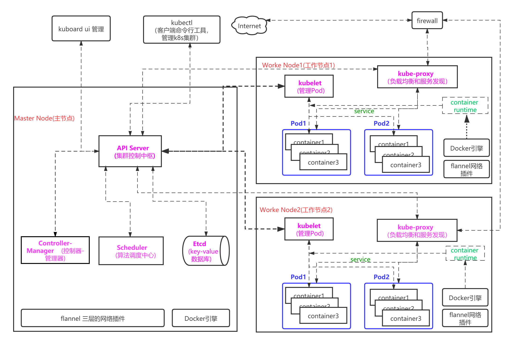
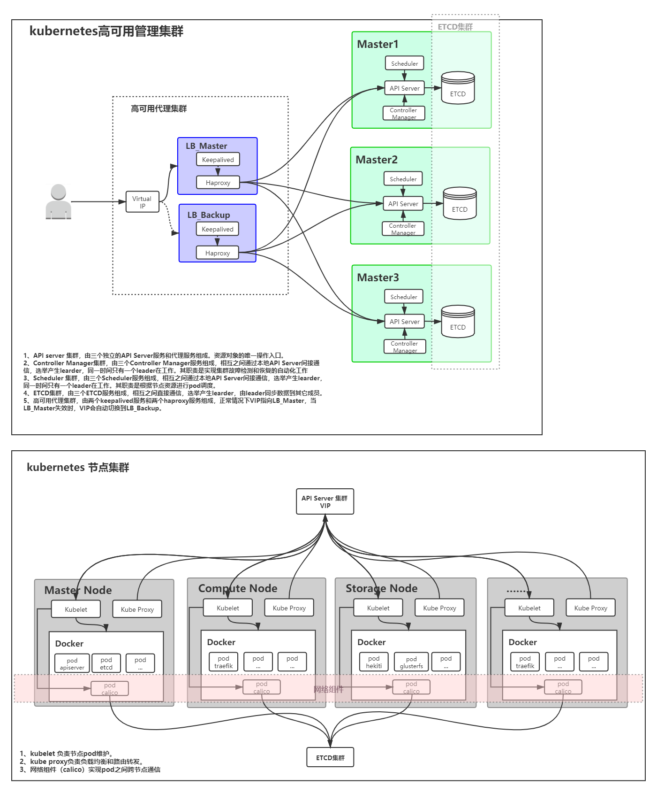

# `ubuntu`系统部署`k8s`分两种方式，一种是在线部署，一种是离线部署

## 一：在线部署(`online-deploy-k8s`)，项目在`online-deploy-k8s`下

## 二：离线部署(`offline-deploy-k8s`), 项目在 `offline-deploy-k8s`下

### 说明事项：

1. 在线部署是手动部署完成，里面提供的有链接文档，以及部署中需要的所有镜像，在线手动部署完成了`k8s`单master两node的集群架构，添加了NFS作为集群的外部存储，完成`prometheus+grafana`的监控系统，以及`kuboard`容器集群的WEB管理工具。
2. 离线部署是由shell脚本自动部署完成，该部署完成了`k8s`单master两node的集群架构、`kuboard`容器集群的WEB管理工具。

### **基础环境：**

| 操作系统              | `k8s`版本  |
| --------------------- | ---------- |
| `Ubuntu 18.04.5  LTS` | `v1.18.05` |

### **架构图**

1. 本次部署架构图

   

2. 三节点高可用架构图

   