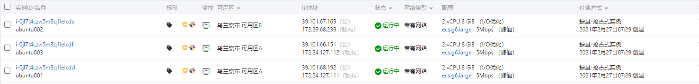

# 在线自动化脚本部署`k8s`

## 准备环境-三台阿里云机器

注册阿里云，选择抢占模式! 



**部署规划：**

| 主机名    | IP             | 角色   |
| --------- | -------------- | ------ |
| ubuntu001 | 172.24.127.111 | master |
| ubuntu002 | 172.29.68.239  | node1  |
| ubuntu003 | 172.24.127.112 | node2  |

注意事项：

```shell
[root@ubuntu001 ~]# kubectl get nodes
NAME        STATUS   ROLES    AGE   VERSION
ubuntu001   Ready    master   85m   v1.18.5
ubuntu002   NotReady    <none>   60m   v1.18.5
ubuntu003   NotReady    <none>   65m   v1.18.5
```

- 当所有node节点注册到集群中后，需要在所有的node上下载网络插件flannel需要的镜像.
```shell
wget http://docs.tangwww.top:18080/k8s/k8s1.18.5/images/master/flannel-v0.13.0.docker
wget http://docs.tangwww.top:18080/k8s/k8s1.18.5/images/master/flanneld-v0.13.0-amd64.docker
docker load -i flannel-v0.13.0.docker
docker load -i flanneld-v0.13.0-amd64.docker
```

```shell
[root@ubuntu001 ~]# kubectl get nodes
NAME        STATUS   ROLES    AGE   VERSION
ubuntu001   Ready    master   85m   v1.18.5
ubuntu002   Ready    <none>   60m   v1.18.5
ubuntu003   Ready    <none>   65m   v1.18.5
```

- 把node节点注册到k8s集群中后，并且状态显示为Ready,需要在master节点上对kube-proxy需要开启ipvs模式,否则宿主机ping不同ClusterIP,集群服务不可以用.
```shell
kubectl get configmap kube-proxy -n kube-system -o yaml > kube-proxy-configmap.yaml
sed -i 's/mode: ""/mode: "ipvs"/' kube-proxy-configmap.yaml
kubectl apply -f kube-proxy-configmap.yaml
rm -f kube-proxy-configmap.yaml
kubectl get pod -n kube-system | grep kube-proxy | awk '{system("kubectl delete pod "$1" -n kube-system")}'
```